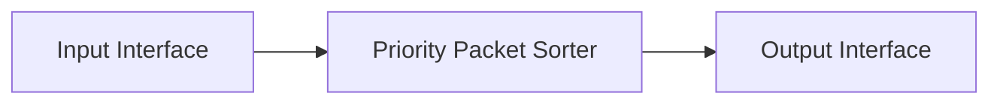
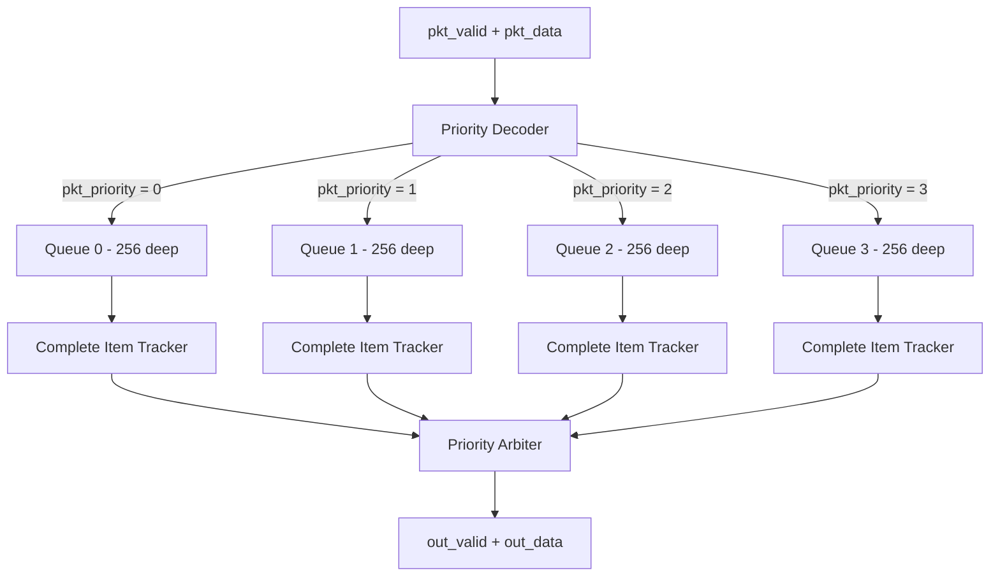
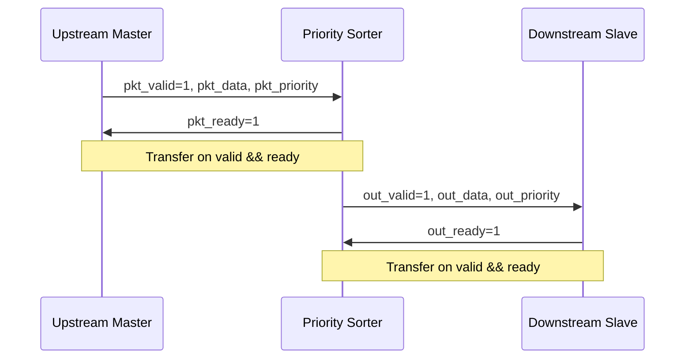

# AXI-Stream Priority Packet Sorter - Block Diagrams

## Block Diagram

```mermaid
flowchart LR
    subgraph Input[Input Interface]
        clk
        rst_n
        pkt_valid
        pkt_ready
        pkt_data
        pkt_priority
        pkt_id
        pkt_sop
        pkt_eop
    end

    subgraph DUT[Priority Packet Sorter]
        P0[P0 Queue]
        P1[P1 Queue]
        P2[P2 Queue]
        P3[P3 Queue]
    end

    subgraph Output[Output Interface]
        out_valid
        out_ready
        out_data
        out_priority
        out_id
        out_sop
        out_eop
    end

    Input --> DUT --> Output
```

## Simplified I/O View

```mermaid
flowchart LR
    IN[Input Interface] --> DUT[Priority Packet Sorter] --> OUT[Output Interface]
```

## Detailed Signal List

```mermaid
flowchart TB
    subgraph Input_Signals
        direction TB
        A1[clk - Clock]
        A2[rst_n - Reset]
        A3[pkt_valid - 1 bit]
        A4[pkt_ready - 1 bit]
        A5[pkt_data - 8 bits]
        A6[pkt_priority - 2 bits]
        A7[pkt_id - 6 bits]
        A8[pkt_sop - 1 bit SOP]
        A9[pkt_eop - 1 bit EOP]
    end

    subgraph Output_Signals
        direction TB
        B1[out_valid - 1 bit]
        B2[out_ready - 1 bit]
        B3[out_data - 8 bits]
        B4[out_priority - 2 bits]
        B5[out_id - 6 bits]
        B6[out_sop - 1 bit SOP]
        B7[out_eop - 1 bit EOP]
    end

    subgraph Status_Signals
        direction TB
        C1[full - 1 bit]
        C2[empty - 1 bit]
        C3[almost_full - 1 bit]
        C4[packet_count - 8 bits]
        C5[priority_status - 4 bits]
    end
```

## Internal Architecture

```mermaid
flowchart TD
    INPUT[pkt_valid + pkt_data] --> PARSE[Priority Decoder]
    PARSE --> |pkt_priority = 0| Q0[Queue 0 - 256 deep]
    PARSE --> |pkt_priority = 1| Q1[Queue 1 - 256 deep]
    PARSE --> |pkt_priority = 2| Q2[Queue 2 - 256 deep]
    PARSE --> |pkt_priority = 3| Q3[Queue 3 - 256 deep]
    
    Q0 --> TRACK0[Complete Item Tracker]
    Q1 --> TRACK1[Complete Item Tracker]
    Q2 --> TRACK2[Complete Item Tracker]
    Q3 --> TRACK3[Complete Item Tracker]
    
    TRACK0 --> ARB[Priority Arbiter]
    TRACK1 --> ARB
    TRACK2 --> ARB
    TRACK3 --> ARB
    
    ARB --> OUTPUT[out_valid + out_data]
```

## Handshaking Flow

```mermaid
sequenceDiagram
    participant Master as Upstream Master
    participant DUT as Priority Sorter
    participant Slave as Downstream Slave

    Master->>DUT: pkt_valid=1, pkt_data, pkt_priority
    DUT->>Master: pkt_ready=1
    Note over Master,DUT: Transfer on valid && ready

    DUT->>Slave: out_valid=1, out_data, out_priority
    Slave->>DUT: out_ready=1
    Note over DUT,Slave: Transfer on valid && ready
```

